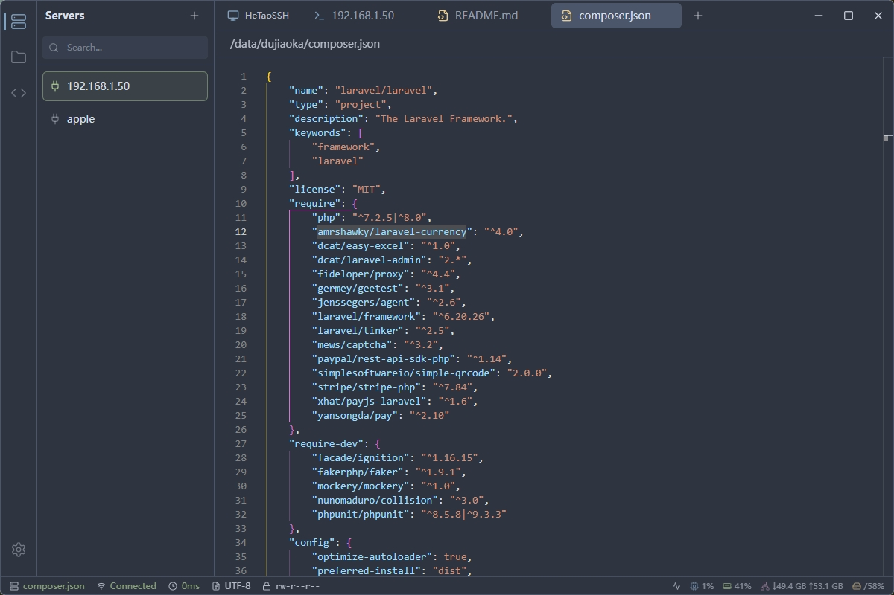
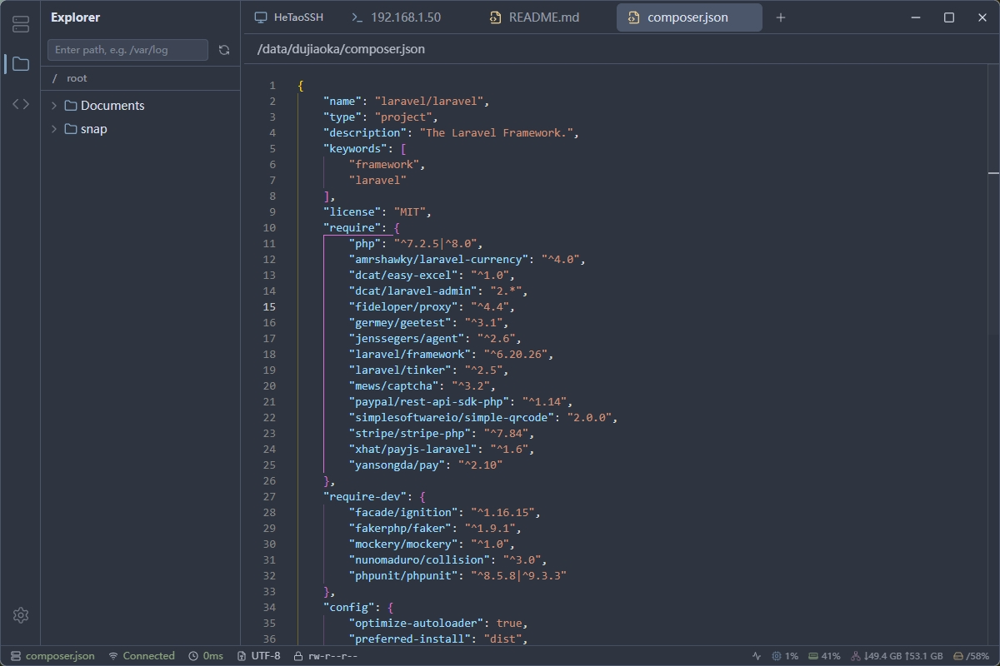
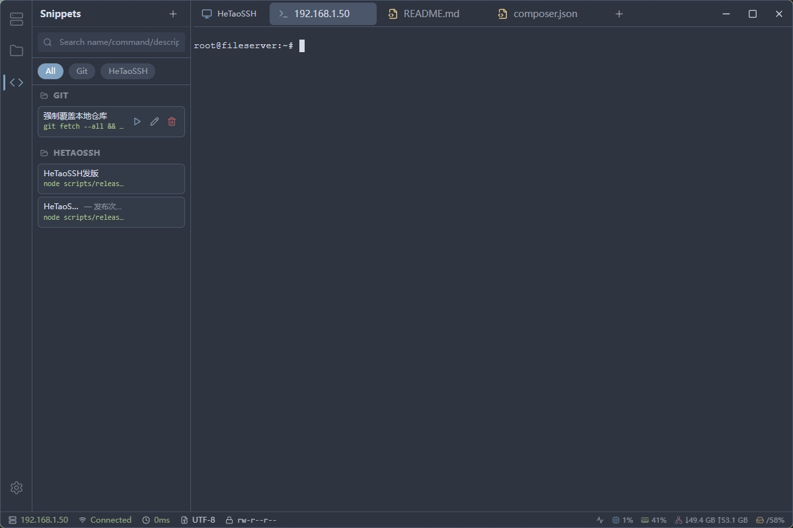
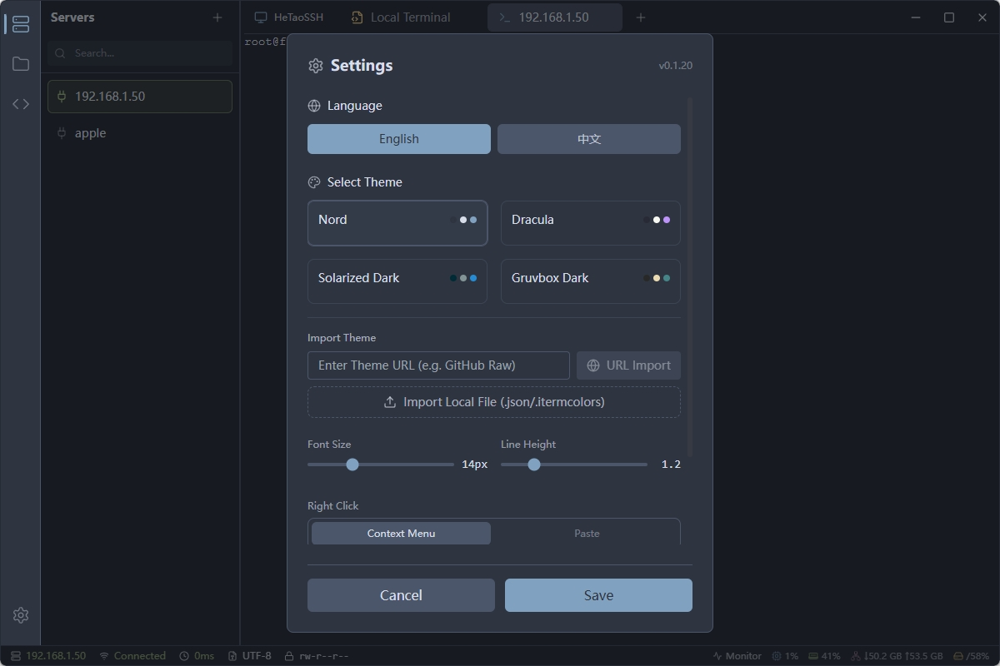

# HeTaoSSH

<div align="center">

**Modern SSH Client built with Tauri 2.0**

[](LICENSE)
[](https://www.rust-lang.org)
[](https://tauri.app)

[English](README.md) | [简体中文](README_zh.md)


</div>

## ✨ Features

- 🔐 **Secure Connection Management** - AES-256 encrypted storage for passwords and keys
- 🖥️ **Multi-tab Terminal** - Manage multiple SSH sessions simultaneously
- ⚡ **High-Performance Terminal** - xterm.js terminal with scrollback, search, split panes, and reconnect-on-keypress
- 💻 **Local Terminal** - Integrated local shell support (PowerShell/Bash)
- 📁 **Remote File Browser** - SFTP file management with drag-and-drop upload, inline progress, and safe delete confirmation
- 📝 **Code Editor** - Monaco Editor (VS Code kernel) with syntax highlighting
- 📊 **System Monitoring** - Real-time CPU, Memory, Disk, and Network monitoring
- 🎯 **Command Snippets** - Quick execution of common commands
- ⌨️ **Discoverable Shortcuts** - Configurable shortcuts, a `Ctrl+/` shortcut overview, and pane switching
- 🔄 **In-app Updates** - Release notes and download progress for application updates
- 🎨 **Theming** - Customizable themes and appearance

## 📸 Screenshots

### 🖥️ Server Management
Easily manage your SSH connections. Supports organizing servers, quick connection toggles, and secure credential storage.


### 📂 File Explorer
Full-featured SFTP client integrated directly into the interface. Browse, upload (drag & drop), download, and edit remote files effortlessly.


#### Dragging files to a remote terminal

Dropping a local file while a connected remote terminal is active opens the **SFTP** sidebar and uploads the file to that connection's current SFTP folder. The sidebar shows inline progress and keeps the completed filename visible briefly before refreshing the directory.

This intentionally does **not** infer the destination from the terminal prompt (for example, after `cd /data/product`): prompts can be customized and do not reliably expose the shell's working directory. Navigate to `/data/product` in the SFTP browser first when that is the desired destination. If no SFTP folder has been opened yet, the remote home directory is used.

### ⚡ Command Snippets
Store your frequently used commands and scripts. Execute them with a single click to boost your productivity.


### 🎨 Modern Terminal
A high-performance terminal experience powered by xterm.js, featuring custom themes, adjustable fonts, multi-tab and split-pane support, terminal search, and reconnect-on-keypress after a disconnect.

## 🏗️ Architecture

```
┌─────────────────────────────────────────────────────────────┐
│                         Frontend                             │
│  ┌──────────┐  ┌──────────┐  ┌──────────┐  ┌──────────┐   │
│  │  Server  │  │ Terminal │  │   File   │  │  System  │   │
│  │   List   │  │  (xterm) │  │  Browser │  │  Monitor │   │
│  └──────────┘  └──────────┘  └──────────┘  └──────────┘   │
│            React + TypeScript + Tailwind CSS               │
└─────────────────────────────────────────────────────────────┘
                              │
                    Tauri IPC Bridge
                              │
┌─────────────────────────────────────────────────────────────┐
│                          Backend                             │
│  ┌──────────┐  ┌──────────┐  ┌──────────┐  ┌──────────┐   │
│  │   SSH    │  │   SFTP   │  │  SQLite  │  │  Crypto  │   │
│  │ (russh)  │  │          │  │  (sqlx)  │  │(AES-256) │   │
│  └──────────┘  └──────────┘  └──────────┘  └──────────┘   │
│                      Rust + Tokio                          │
└─────────────────────────────────────────────────────────────┘
```

## 🚀 Quick Start

### Prerequisites

- [Rust](https://www.rust-lang.org/tools/install) (1.75+)
- [Node.js](https://nodejs.org/) (18+)
- [pnpm](https://pnpm.io/installation)

### Installation

```bash
# Clone the repository
git clone https://github.com/hthappy/HeTaoSSH.git
cd HeTaoSSH

# Install dependencies
pnpm install

# Start development server
pnpm tauri dev

# Build for production
pnpm tauri build
```


## 📖 Documentation

- [User Guide](docs/USER_GUIDE.md) - How to use HeTaoSSH
- [API Documentation](docs/API.md) - Tauri commands and data structures

## 🤝 Contributing

Contributions are welcome! Please feel free to submit a Pull Request.

1. Fork the repository
2. Create your feature branch (`git checkout -b feature/AmazingFeature`)
3. Commit your changes (`git commit -m 'Add some AmazingFeature'`)
4. Push to the branch (`git push origin feature/AmazingFeature`)
5. Open a Pull Request

## 📄 License

This project is licensed under the MIT License - see the [LICENSE](LICENSE) file for details.
