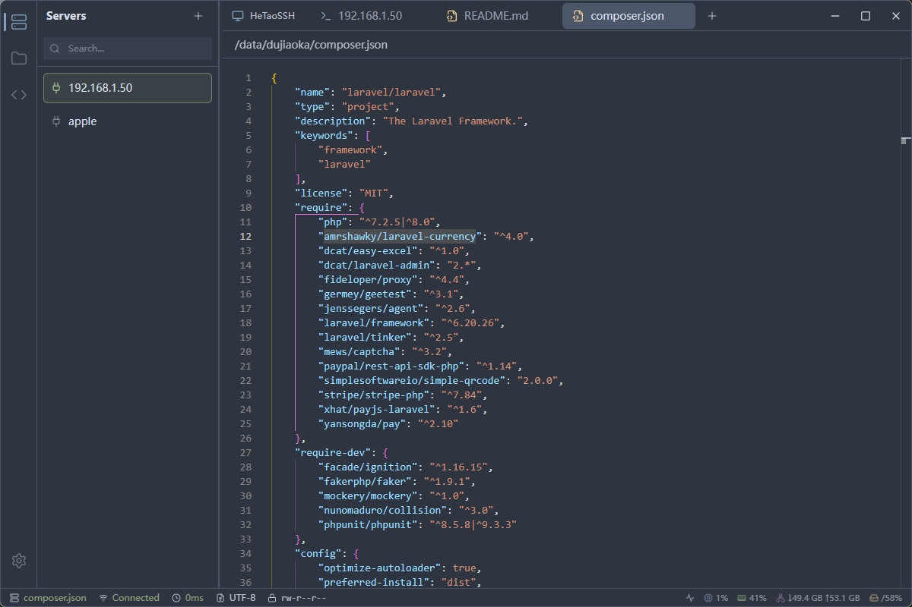
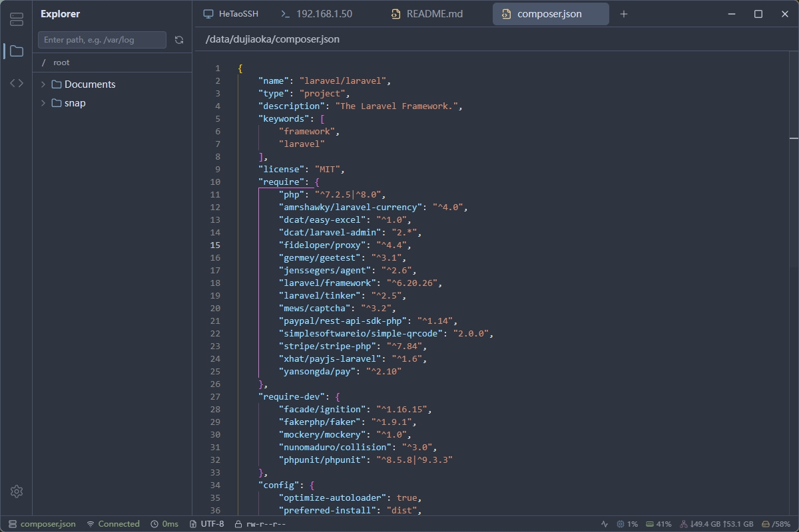
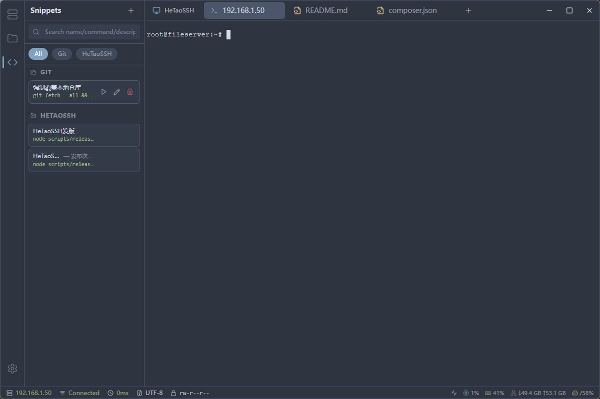
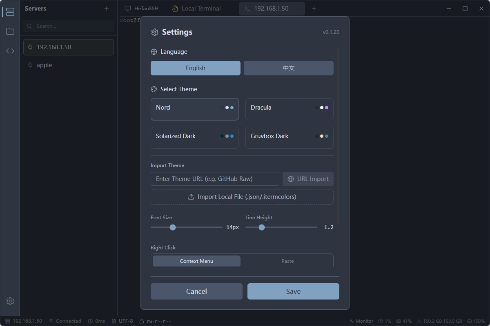

# HeTaoSSH

<div align="center">

**基于 Tauri 2.0 构建的现代化 SSH 客户端**

[](LICENSE)
[](https://www.rust-lang.org)
[](https://tauri.app)

[English](README.md) | [简体中文](README_zh.md)


</div>

## ✨ 功能特性

- 🔐 **安全连接管理** - 采用 AES-256 加密存储密码和密钥
- 🖥️ **多标签终端** - 同时管理多个 SSH 会话
- ⚡ **高性能终端** - 基于 xterm.js 和 WebGL 加速
- 💻 **本地终端** - 集成本地 Shell 支持 (PowerShell/Bash)
- 📁 **远程文件管理** - 支持 SFTP 文件管理与拖拽上传
- 📝 **代码编辑器** - 内置 Monaco Editor (VS Code 内核)，支持语法高亮
- 📊 **系统监控** - 实时监控 CPU、内存、磁盘和网络状态
- 🎯 **命令片段** - 常用命令的快速保存与执行
- 🔄 **自动更新** - 通过 GitHub Releases 实现无缝自动更新
- 🎨 **主题系统** - 支持自定义主题和外观

## 📸 软件截图

### 🖥️ 服务器管理
轻松管理您的 SSH 连接。支持密码和密钥认证、分组管理以及快速搜索功能。


### 📂 文件管理器
集成的 SFTP 客户端，实现无缝文件传输。支持拖拽上传、右键下载以及直接编辑远程文件。


### ⚡ 命令片段
保存常用命令和脚本以便快速访问。一键执行复杂操作，提升工作效率。


### 🎨 现代化终端
基于 xterm.js 的高性能终端体验，支持自定义主题、字体调节以及多标签页功能。


## 🏗️ 架构设计

```
┌─────────────────────────────────────────────────────────────┐
│                            前端                              │
│  ┌──────────┐  ┌──────────┐  ┌──────────┐  ┌──────────┐   │
│  │  服务器  │  │   终端   │  │   文件   │  │   系统   │   │
│  │   列表   │  │  (xterm) │  │   管理   │  │   监控   │   │
│  └──────────┘  └──────────┘  └──────────┘  └──────────┘   │
│            React + TypeScript + Tailwind CSS               │
└─────────────────────────────────────────────────────────────┘
                              │
                    Tauri IPC Bridge
                              │
┌─────────────────────────────────────────────────────────────┐
│                            后端                              │
│  ┌──────────┐  ┌──────────┐  ┌──────────┐  ┌──────────┐   │
│  │   SSH    │  │   SFTP   │  │  SQLite  │  │  加密    │   │
│  │ (russh)  │  │          │  │  (sqlx)  │  │(AES-256) │   │
│  └──────────┘  └──────────┘  └──────────┘  └──────────┘   │
│                      Rust + Tokio                          │
└─────────────────────────────────────────────────────────────┘
```

## 🚀 快速开始

### 环境要求

- [Rust](https://www.rust-lang.org/tools/install) (1.75+)
- [Node.js](https://nodejs.org/) (18+)
- [pnpm](https://pnpm.io/installation)

### 安装步骤

```bash
# 克隆仓库
git clone https://github.com/hthappy/HeTaoSSH.git
cd HeTaoSSH

# 安装依赖
pnpm install

# 启动开发服务器
pnpm tauri dev

# 构建生产版本
pnpm tauri build
```


## 📖 文档

- [用户指南](docs/USER_GUIDE.md) - 如何使用 HeTaoSSH
- [API 文档](docs/API.md) - Tauri 命令和数据结构

## 🤝 贡献指南

欢迎提交 Pull Request 来改进本项目！

1. Fork 本仓库
2. 创建特性分支 (`git checkout -b feature/AmazingFeature`)
3. 提交更改 (`git commit -m 'Add some AmazingFeature'`)
4. 推送到分支 (`git push origin feature/AmazingFeature`)
5. 提交 Pull Request

## 📄 开源协议

本项目基于 MIT 协议开源 - 详见 [LICENSE](LICENSE) 文件。
